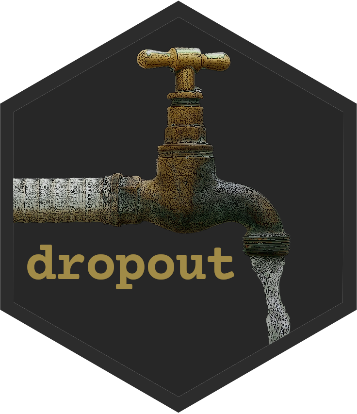

# dropout

<!-- badges: start -->
<!-- badges: end -->

The aim of dropout is to provide tools for dropout analysis when working with survey data.

## Installation

You can install the development version of dropout like so:

``` r
# FILL THIS IN! HOW CAN PEOPLE INSTALL YOUR DEV PACKAGE?
```

## Example

This is a basic example which shows you how to solve a common problem:

``` r
library(dropout)
## basic example code
```

